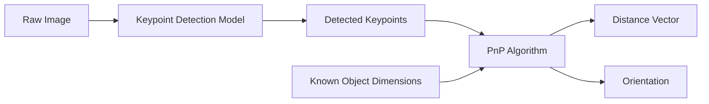
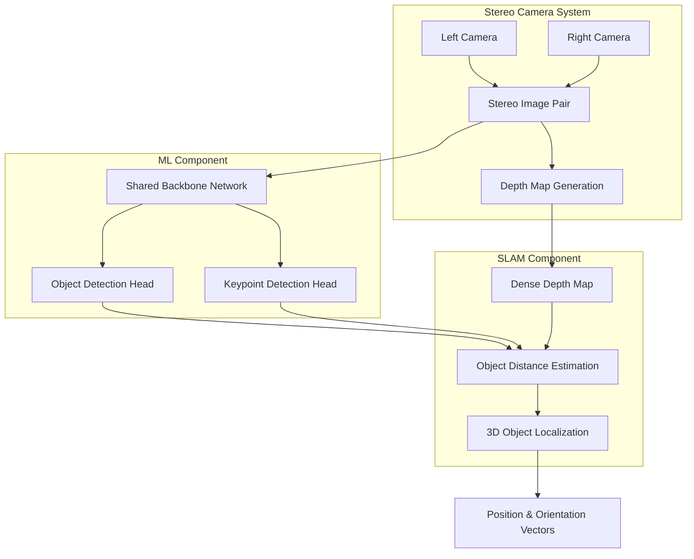

# Vision System Architecture Plan

## System Objectives

The vision system is designed to provide comprehensive environmental perception and navigation support for the autonomous underwater vehicle:

- **Object Detection & Localization**: Identify objects in the environment and compute distance vectors to each target
- **Velocity Estimation**: Determine the robot's speed through visual odometry
- **Environmental Mapping**: Generate depth maps of the surrounding field
- **Navigation Support**: Assist the navigation algorithm with waypoint following capabilities
- **Dynamic Waypoint Generation**: Enable visual servoing by dynamically creating and tracking waypoints

## System Architecture

### Component Breakdown

#### ML Component
- **Object Identification**
  - Gate and path marker detection
  - Gripper object recognition
  - General objects of research interest

- **Keypoint Detection**
  - Four corners of the gate
  - key features on objects/markers

#### SLAM Component
- **Distance Estimation**
  - [Stereo matching algorithms](https://www.notion.so/Research-Vision-Algorithms-2f18a3eca2f0804aac9ae2d4a157d1ff?pvs=21) (SGBM preferred over Hirschmuller-Heiko)
  - Depth map generation

- **Motion Estimation**
  - Velocity computation through temporal derivatives

#### Stereo Vision Module
- Geometric distance calculation using triangulation
- Disparity-based depth estimation

## Data Flow Architecture

### Phase 1: Monocular Camera (Current Implementation)

**Pipeline Description:**
1. Capture raw image from monocular camera
2. Apply keypoint detection model to extract object features
3. Leverage known object dimensions with detected keypoints
4. Use Perspective-n-Point (PnP) algorithm to solve for 6DOF pose
5. Output distance vector and orientation to the object

### Phase 2: Stereo Camera (Future Development)

**Pipeline Description:**
1. **Stereo Capture**: Acquire synchronized image pairs from left and right cameras
2. **Depth Estimation**: Generate dense depth map using stereo matching (SGBM)
3. **ML Processing**:
   - Single backbone network with dual heads for efficiency
   - Object detection head for bounding boxes and classification
   - Keypoint detection head for precise feature localization
4. **SLAM Integration**:
   - Fuse depth map with detected objects
   - Compute accurate 3D positions of identified objects
   - Output position and orientation vectors for navigation

## Current Implementation Status

1. YOLO Keypoint Model
2. Raw Keypoints
3. Post-Processing & Validation
4. Cleaned Keypoints
5. cv.solvePnP Algorithm
6. Object Pose Vector
7. Gate Center Offset

**In Development:**
- **Stereo Vision System**: Hardware integration and calibration in progress
- **custom SSD model** for future same backbone architecture

**Hardware:**
- **Platform**: NVIDIA Jetson Orin Nano (8GB RAM)
- **Performance**: Real-time inference capability