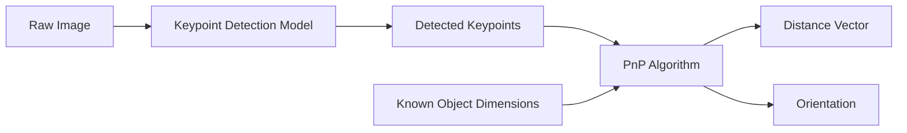
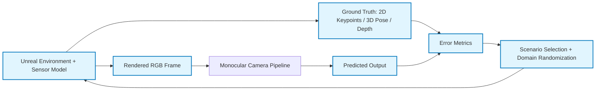
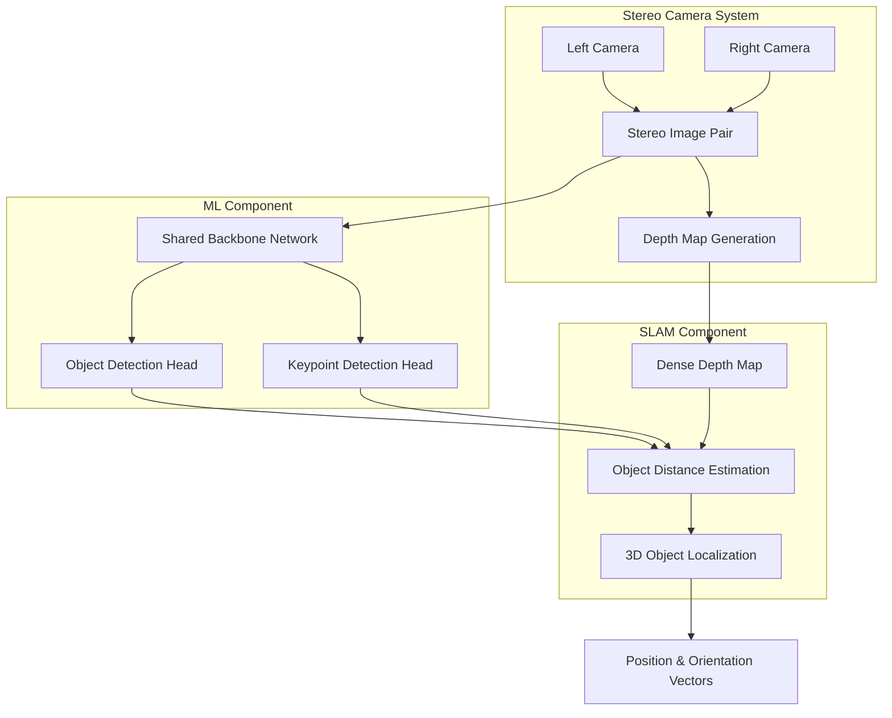

# Vision System Architecture Plan

## System Objectives

The vision system is designed to provide comprehensive environmental perception and navigation support for the autonomous underwater vehicle:

### Real World
- **Object Detection & Localization**: Identify objects in the environment and compute distance vectors to each target
- **Velocity Estimation**: Determine the robot's speed through visual odometry and temporal pose estimation
- **Environmental Mapping**: Generate depth maps of the surrounding field
- **Navigation Support**: Assist the navigation algorithm with waypoint following capabilities
- **Dynamic Waypoint Generation**: Enable visual creating and tracking waypoints

### Simulation
- **Synthetic Data Generation (Unreal)**: Generate photorealistic underwater imagery for training and testing detection + keypoint models
- **Ground Truth Labeling**: Export automatic labels per frame (2D keypoints, object pose, camera pose, depth) to enable supervised learning and quantitative evaluation
- **Domain Randomization for Sim2Real**: Randomize lighting, turbidity, particles, textures, and camera noise to improve real-world robustness
- **Closed-Loop Validation**: Benchmark perception outputs against ground truth across controlled scenarios (pose error, reprojection error, detection metrics)
- **Hardware-in-the-Loop Readiness**: Validate runtime performance by streaming simulated frames through the Jetson inference stack before pool deployment

## System Architecture

### Component Breakdown

#### ML Component
- **Object Identification**
  - Gate and path marker detection
  - Gripper object recognition
  - General objects of research interest

- **Keypoint Detection**
  - Four corners of the gate
  - Key features on objects/markers
 
- **Temporal Filtering**
  - Smoothing of keypoints and pose estimates across frames

#### SLAM Component
- **Distance Estimation**
  - [Stereo matching algorithms](https://www.notion.so/Research-Vision-Algorithms-2f18a3eca2f0804aac9ae2d4a157d1ff?pvs=21) (SGBM preferred over Hirschmuller-Heiko)
  - Gaussian Splatting
  - Depth map generation

- **Motion Estimation**
  - Velocity computation through temporal derivatives of pose estimates

#### Stereo Vision Module
- Geometric distance calculation using stereo triangulation
- Disparity-based depth estimation from rectified image pairs

#### Simulation Component (Unreal Engine)
- **Environment Rendering**
  - Pool, gate, and marker assets with underwater lighting and materials  
  - Water effects: turbidity, backscatter, caustics, and particles  

- **Sensor Modeling**
  - Camera intrinsics and distortion matched to real hardware  
  - Noise models (blur, exposure variation, motion blur)

- **Ground Truth Generation**
  - 2D labels: bounding boxes, keypoints, segmentation masks  
  - 3D labels: object pose, camera pose, and depth  
  - Relative pose: object-to-camera vectors  

- **Scenario Orchestration**
  - Automatic camera trajectories around gates  
  - Randomized lighting, visibility, and object placement  
  - Edge-case generation (occlusion, glare, far range, low contrast)
  - Adaptive scenario generation driven by failure cases and error metrics

#### Data & Evaluation Module
- **Dataset Construction**
  - Build labeled datasets from simulation and real-world captures  
  - Maintain train/validation/test splits by scenario
 
- **Coordinate Frame Management**
  - Consistent camera, object, and world coordinate frame conventions across sim and physical environments

- **Performance Metrics**
  - Keypoint reprojection error  
  - Pose estimation error (translation and rotation)  
  - Detection precision and recall  

- **Failure Mode Analysis**
  - Identify conditions causing keypoint or pose failure  
  - Feed failure cases back into simulation scenario generation

## Data Flow Architecture

### Phase 1: Monocular Camera Pipeline (Current Implementation)

### Simulation

**Pipeline Description:**
1. Capture raw image from monocular camera
2. Apply keypoint detection model to extract object features
3. Leverage known object dimensions with detected keypoints
4. Use Perspective-n-Point (PnP) algorithm to solve for 6DOF pose
5. Output distance vector and orientation to the object

### Phase 2: Stereo Camera (Future Development)

**Pipeline Description:**
1. **Stereo Capture**: Acquire synchronized image pairs from left and right cameras
2. **Depth Estimation**: Generate dense depth map using stereo matching (SGBM)
3. **ML Processing**:
   - Single backbone network with dual heads for efficiency
   - Object detection head for bounding boxes and classification
   - Keypoint detection head for precise feature localization
4. **SLAM Integration**:
   - Fuse depth map with detected objects
   - Compute accurate 3D positions of identified objects
   - Output position and orientation vectors for navigation

## Current Implementation Status

**Real World** 
1. YOLO Keypoint Model
2. Raw Keypoints
3. Post-Processing & Validation
4. Cleaned Keypoints
5. cv.solvePnP Algorithm
6. Object Pose Vector
7. Gate Center Offset

**Simulation**
1. Unreal Engine – MATLAB Interface (robot control via MATLAB commands)  
2. Simulated Robot (Manny) Motion Control in Unreal  
3. Pool Environment Modeling (accurate dimensions, tiling, and materials)  
4. Underwater Lighting & Material Setup (initial realism pass)

**In Development:**
- **Stereo Vision System**: Hardware integration and calibration in progress
- **Custom SSD Model** for future same backbone architecture
- **Simulation Testbed**: Setup of Unreal environment for data capture and ground-truth-based algorithm evaluation

**Hardware:**
- **Platform**: NVIDIA Jetson Orin Nano (8GB RAM)
- **Performance**: Real-time inference capability
