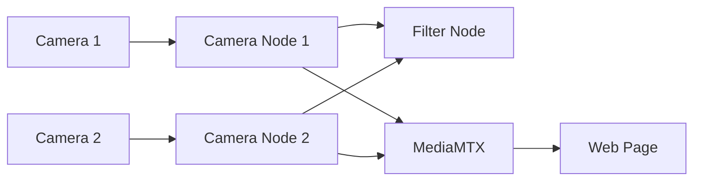

# Vision
Wiki [notion page](https://www.notion.so/crsucd/Vision-2a98a3eca2f080979dfbdb59448b942f)

## Architecture




**Camera Streaming & Recording:**
Check out the [Simultaneous Stream and Recording Guide](./Simultaneous_Stream_and_Recording.md).

**ML models:**
See [`machine_learning`](./machine_learning) dir

### TODO for [`onboard/src/vision`](../onboard/src/vision) package:

- [x] Add two more camera feed publisher nodes
    - [ ] Need a node to filter listen on both topics and filter out of the sync ones. 
        - [ ] Make the keypoint detector node read from a camera feed topic instead of a video file
    - [x] update the (web page)[../remote_control_webpage] to show stereo camera feeds
- [x] Use a custom message type for keypoint results instead of a string
- [x] Switch to use `.engine` instead of `.torchscript` for *speed*
- [x] fix up docker for jetson 

## Docker
1. Build the docker image:
```bash
cyclone@jetson:~/Robosub/sys-arch-2026$ docker build -f Dockerfile.jazzy -t sys-arch .
```
2. Go into the container and compile the vision package:
```bash
cyclone@jetson:~/Robosub/sys-arch-2026$  jetson-containers run --name sys-arch-build sys-arch:latest
```
```
root@jetson:~/sys-arch-2026# colcon build --packages-up-to vision
```
3. Save the compiled image:
```bash
cyclone@jetson:~/Robosub/sys-arch-2026$ docker commit sys-arch-build sys-arch:compiled
```
Not doing everything in a `RUN` command in the Dockerfile because nvidia libraries are not mounted at creation time, so `colcon build` needs to compile at runtime. fxxk nvidia.