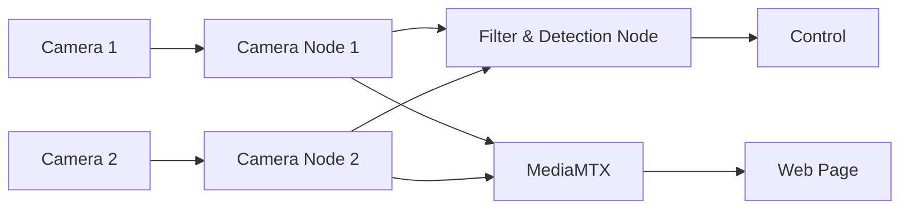

# Vision
### Wiki [notion page](https://www.notion.so/crsucd/Vision-2a98a3eca2f080979dfbdb59448b942f)

### TODO for [`onboard/src/vision`](../onboard/src/vision) package:

- [x] Add two more camera feed publisher nodes
    - [x] Need a node to filter listen on both topics and filter out of the sync ones. 
        - [x] Make the keypoint detector node read from a camera feed topic instead of a video file
    - [x] update the (web page)[../remote_control_webpage] to show stereo camera feeds
- [x] Use a custom message type for keypoint results instead of a string
- [x] Switch to use `.engine` instead of `.torchscript` for *speed*
- [x] fix up docker for jetson 

## Architecture




**Camera Streaming & Recording:**
Check out the [Simultaneous Stream and Recording Guide](./Simultaneous_Stream_and_Recording.md).

## Machine Learning For Vision
We are using YOLO from ultralytics for out keypoint and object (bounding box) detection.

### Storage
We use google drive to store [dataset](https://drive.google.com/drive/folders/1LpS9NoPVFxXUxyv4pWcpeMHbMz_F3LiW?usp=drive_link) and [trained models](https://drive.google.com/drive/folders/13Y4li4JXQh-4mSZ9f0kfoXMQ_958dQYn?usp=drive_link). 

#### Preparation
For dataset generated from unreal engine. Use [`convert_to_yolo.py`](tools/convert_to_yolo.py) to convert the dataset to YOLO format. You may need to use [`clean_dataset.py`](tools/clean_dataset.py) to clean the dataset because ultralytics is stupid that it requires the keypoints not visible to be normalized to [0, 1].

#### Training and exporting
We use ultralytics yolo for [training](https://docs.ultralytics.com/modes/train/) and [exporting](https://docs.ultralytics.com/modes/export/).

## Docker
1. Build the docker image:
```bash
cyclone@jetson:~/Robosub/sys-arch-2026$ docker build -f Dockerfile.jazzy -t sys-arch .
```
2. Go into the container and compile the vision package:
```bash
cyclone@jetson:~/Robosub/sys-arch-2026$  jetson-containers run --name sys-arch-build sys-arch:latest
```
```
root@jetson:~/sys-arch-2026# colcon build --packages-up-to vision
```
3. Save the compiled image:
```bash
cyclone@jetson:~/Robosub/sys-arch-2026$ docker commit sys-arch-build sys-arch:compiled
```
Not doing everything in a `RUN` command in the Dockerfile because nvidia libraries are not mounted at creation time, so `colcon build` needs to compile at runtime. fxxk nvidia.